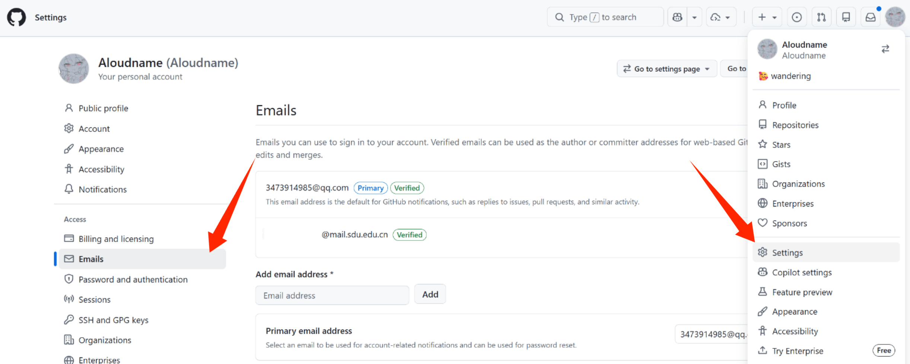
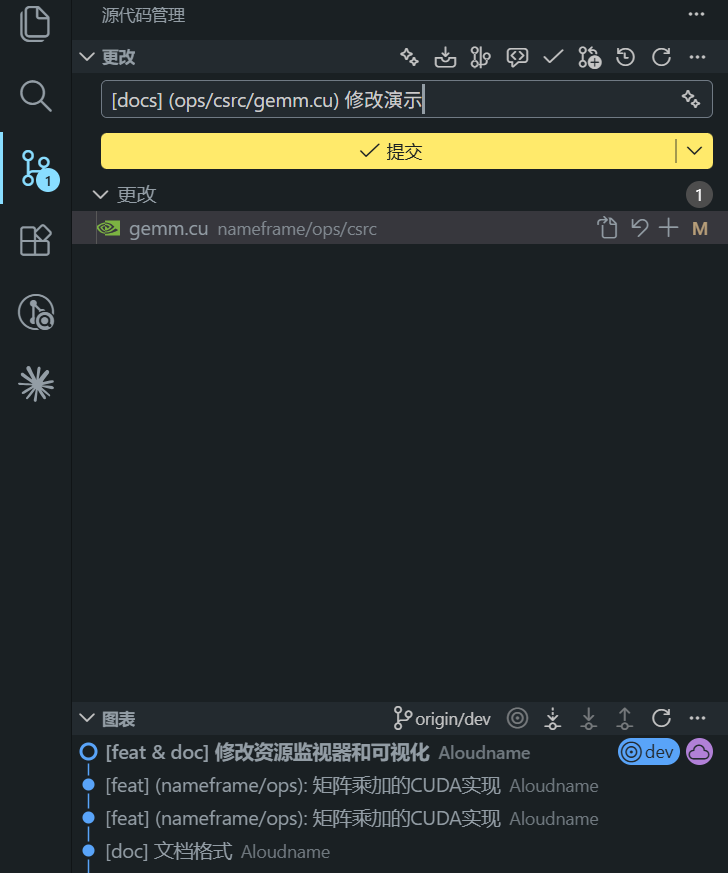
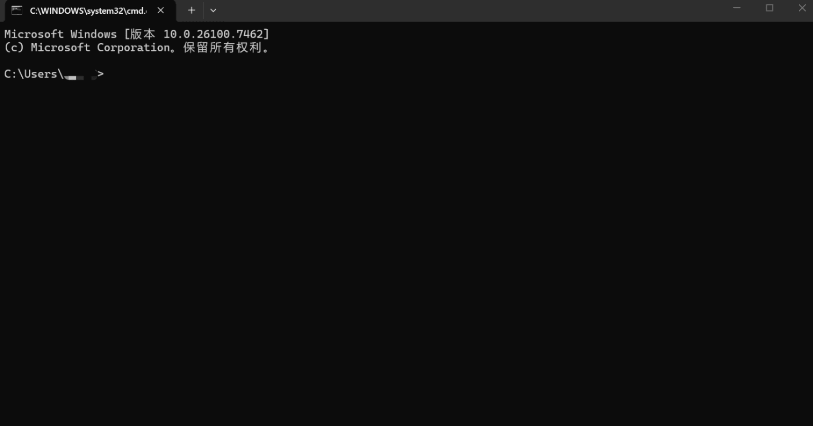
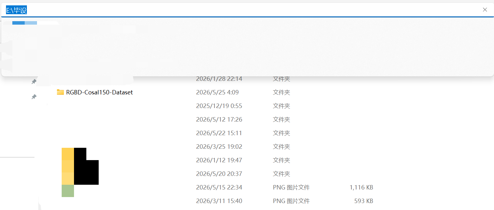
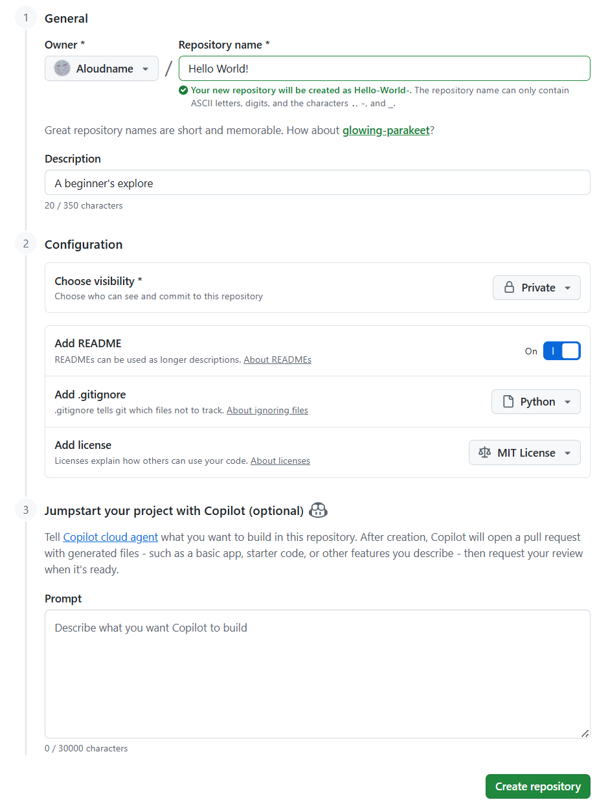
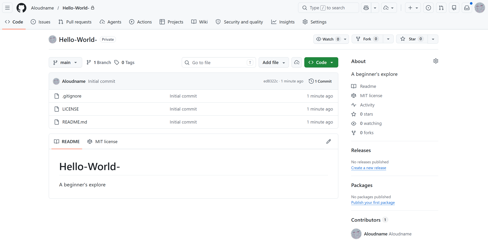

# 1 GitHub使用

author @Aloudname @ZebraWoo

## 引言

[GitHub](https://github.com/) 是世界上最大的代码托管平台。实际上，它托管的不仅仅有代码，还有一些电子书等等其他资料（比如 [公开书籍-mymmsc](https://github.com/mymmsc/books)）。实际上就是一个人人可用的仓库。这个仓库还支持多人共同创作、管理一个大型项目的代码，用起来很方便。

另外，一个人的 GitHub repo 也反映了他的工作方向、最近在做的项目以及他的项目受到了多少人的关注等等。拥有高收藏的 GitHub repo，或者成为著名开源项目（比如深度学习领域的 [PyTorch库](https://github.com/pytorch/pytorch)）的重要贡献者，在找工作时的 ~~威力比原子弹还要大~~ 加分程度不低于顶刊。

Github 这个系列的教程包含新建项目、项目管理、多人协作开发项目时的注意事项等。

## 入门

[注册参考教程](https://blog.csdn.net/2501_90245260/article/details/145097049)

注册完毕后，可以右上角点击头像 -> `Settings` -> 左边栏的 `Emails`，给自己添加一个学生邮箱做备用邮箱，可以申请 2 年的学生版 `GitHub Copilot Pro`，每个月有固定的 AI Agent 额度和自动补全。然而这个额度被削过很多次，现在已经少得可怜。尽管如此，仍然建议申请一个学生版 `GitHub Copilot Pro`，在编辑器中写代码时，有无限额度的自动补全。



建议是边用边练，一边锻炼写代码的能力，一边锻炼代码工程化管理的能力。在你的代码编辑器中（以 vscode 举例），搜索以下拓展并安装：


这样就能方便地提交对项目的更改并查看更改记录了：



另外，我们还要安装两个仓库管理的命令行工具 `Git` 以及 `GitHub CLI`。安装、配置 git 服务的教程可以参考 [这里](https://blog.csdn.net/2301_80035882/article/details/155000175)；安装、配置 GitHub CLI 服务的教程可以参考 [这里](https://disruptcat.com/technology/github-cli/)。

怎么打开命令行呢？对 Windows 系统，直接在底部栏的 “搜索” 输入 `cmd`，找到 “命令提示符”，选择 “打开” 或者 “以管理员身份运行”（运行一些权限需求较高的命令时）。映入眼帘的是 ~~嘉豪们常用的~~ 黑色页面：



还有两种方式：按 `Win` + `R`，输入 `cmd` 进入，或者直接左键单击目标文件夹的路径，输入 `cmd` 进入命令行：



安装了 `Git` 以及 `GitHub CLI` 后，可以在命令行里运行查看版本号的命令 `-v` 或者 `--version` 检查安装和配置是否正确：

```bash
# git
git -v
git --version

# GitHub CLI
gh -v
gh --version
```

如果提示

> 'xxx' 不是内部或外部命令，也不是可运行的程序或批处理文件。

可能是 **文件缺损**，或者 **未配置环境变量**。以 `git` 举例，我们需要检查安装文件夹中有没有 `git.exe`。命令行中输入：

```bash
# 全局查找 git.exe
where git.exe
```

如果返回的不是 `git.exe` 路径，说明 **文件缺损**，需要重装。

如果有，说明文件确实下载了，但未配置环境变量，导致系统找不到 `git.exe` 所在的文件夹。复制 `git.exe` 所在文件夹的 **绝对路径**（从磁盘号开始的路径）。比如，找到 `git.exe` 在 `D:\Git\bin\git.exe`，那么我们复制的路径就是 `D:\Git\bin`。复制好后，在底部栏搜索 “编辑系统环境变量”，进入后点击“环境变量(N)”，选中 “系统变量” 里的 `Path` ，点击 “编辑”、“新建” ，粘贴刚刚复制的地址（**千万不要带最后一级** `\git.exe`），然后一直点击 “确定”。手动配置环境变量 `PATH = D:\Git\bin`，相当于告诉系统 `git.exe`在哪个文件夹。这样，有了环境变量，`git` 命令便可以在任何路径的命令行中调用。

成功安装了这两个管理包，万事俱备，我们要正式开始了！学一门编程语言的第一步往往是 "Hello world!"，我们也将通过创建一个 "Hello world!" 仓库来学习项目管理。如何创建属于自己的仓库呢？

## 创建自己的仓库

### 1. 在 Web 界面创建

最容易上手的方式是从 GitHub 官网（Web 界面）直接创建仓库。登录 GitHub 后，点击左上角头像，选择 `Repositories`（仓库）进入，在新界面里点击绿色的 `New` 新建一项目。


填写各项初始设置。从上往下，第一项是仓库名（只能使用ASCII 字符、数字、英文点 `.`、英文横线 `-` 和英文下划线 `_`），第二项仓库描述（支持中文）。重要的是下面的配置项 `Configuration`。`Choose visibility`（必填，默认公开）可选仓库是否公开；`Add README` 可选是否加一文档说明文件 `README.md`；`Add .gitignore`可选是否添加一 `.gitignore` 文件（这个后面会细说）；`Add license` 可选是否添加一 [开源许可证](https://blog.csdn.net/qq_35246620/article/details/77647234)（<- 这是什么？）。



填写完毕后点击 `Create repository`，就可以看见我们创建的新项目：



### 2. 从本地代码构建仓库

我已经写了很多代码，我想直接用代码构建一个仓库。怎么办？在命令行中进入该项目的文件夹，运行：

```bash
# 创建远程 GitHub 仓库和本地 Git 仓库并关联之，推送本地文件至远程仓库
gh repo create Hello-World --public/--private --source=. --remote=hello --push
```

`Hello-World` 是创建的远程仓库名；`--public/--private` 控制仓库是否公开；`--source` 指定本地仓库的位置；`--remote` 给远程仓库起个方便的别名；`--push` 将本地仓库的内容传至远程仓库。
