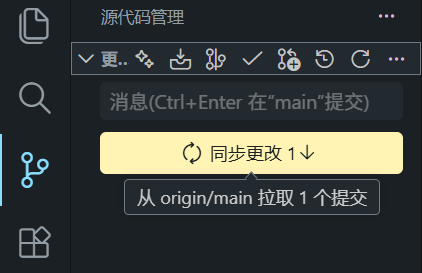
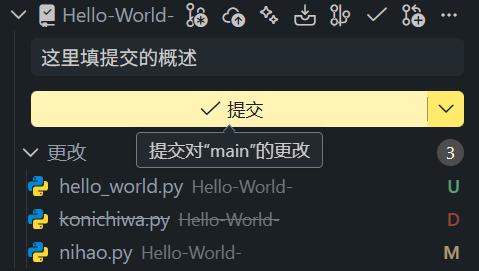
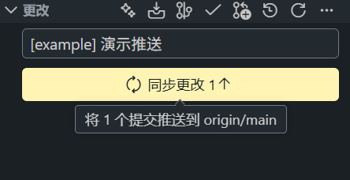
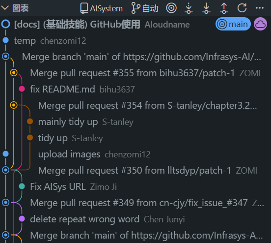
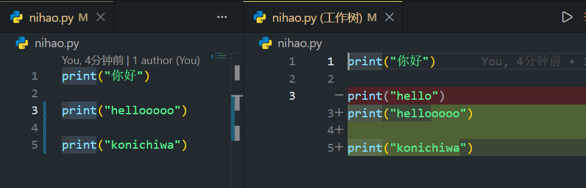
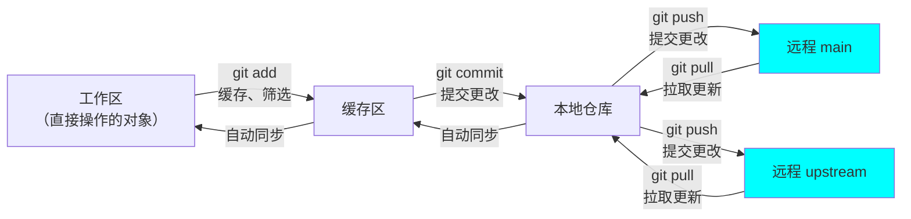

# 1 GitHub使用

>   **[<span style="color:inherit;">Aloudname</span>](https://github.com/Aloudname)**


## 引言

[GitHub](https://github.com/) 是世界上最大的代码托管平台。实际上，它托管的不仅仅有代码，还有一些电子书等等其他资料（比如 [公开书籍-mymmsc](https://github.com/mymmsc/books)）。实际上就是一个人人可用的仓库。这个仓库还支持多人共同创作、管理一个大型项目的代码，用起来很方便。

另外，一个人的 GitHub repo 也反映了他的工作方向、最近在做的项目以及他的项目受到了多少人的关注等等。拥有高收藏的 GitHub repo，或者成为著名开源项目（比如深度学习领域的 [PyTorch库](https://github.com/pytorch/pytorch)）的重要贡献者，在找工作时的 ~~威力比原子弹还要大~~ 加分程度不低于顶刊。

GitHub 这个系列的教程包含新建项目、项目管理、多人协作开发项目时的注意事项等。

## 入门

[注册参考教程](https://blog.csdn.net/2501_90245260/article/details/145097049)

注册完毕后，可以右上角点击头像 -> `Settings` -> 左边栏的 `Emails`，给自己添加一个学生邮箱做备用邮箱，可以申请 2 年的学生版 `GitHub Copilot Pro`，每个月有固定的 AI Agent 额度和自动补全。然而这个额度被削过很多次，现在已经少得可怜。尽管如此，仍然建议申请一个学生版 `GitHub Copilot Pro`，在编辑器中写代码时，有无限额度的自动补全。


建议是边用边练，一边锻炼写代码的能力，一边锻炼代码工程化管理的能力。在你的代码编辑器中（以 VScode 举例），搜索以下拓展并安装：


这样就能方便地提交对项目的更改并查看更改记录了：


另外，我们还要安装两个仓库管理的命令行工具 `Git` 以及 `GitHub CLI`。安装、配置 git 服务的教程可以参考 [这里](https://blog.csdn.net/2301_80035882/article/details/155000175)；安装、配置 GitHub CLI 服务的教程可以参考 [这里](https://disruptcat.com/technology/github-cli/)。

怎么打开命令行呢？对 Windows 系统，直接在底部栏的 “搜索” 输入 `cmd`，找到 “命令提示符”，选择 “打开” 或者 “以管理员身份运行”（运行一些权限需求较高的命令时）。映入眼帘的是 ~~嘉豪们常用的~~ 黑色页面：


还有两种方式：按 `Win` + `R`，输入 `cmd` 进入，或者直接左键单击目标文件夹的路径，输入 `cmd` 进入命令行：


安装了 `Git` 以及 `GitHub CLI` 后，可以在命令行里运行查看版本号的命令 `-v` 或者 `--version` 检查安装和配置是否正确：

```bash
# git
git -v
git --version

# GitHub CLI
gh -v
gh --version
```

如果提示

> 'xxx' 不是内部或外部命令，也不是可运行的程序或批处理文件。

可能是 **文件缺损**，或者 **未配置环境变量**。以 `git` 举例，我们需要检查安装文件夹中有没有 `git.exe`。命令行中输入：

```bash
# 全局查找 git.exe
where git.exe
```

如果返回的不是 `git.exe` 路径，说明 **文件缺损**，需要重装。

如果有，说明文件确实下载了，但未配置环境变量，导致系统找不到 `git.exe` 所在的文件夹。复制 `git.exe` 所在文件夹的 **绝对路径**（从磁盘号开始的路径）。比如，找到 `git.exe` 在 `D:\Git\bin\git.exe`，那么我们复制的路径就是 `D:\Git\bin`。复制好后，在底部栏搜索 “编辑系统环境变量”，进入后点击“环境变量(N)”，选中 “系统变量” 里的 `Path` ，点击 “编辑”、“新建” ，粘贴刚刚复制的地址（**千万不要带最后一级** `\git.exe`），然后一直点击 “确定”。手动配置环境变量 `PATH = D:\Git\bin`，相当于告诉系统 `git.exe`在哪个文件夹。这样，有了环境变量，`git` 命令便可以在任何路径的命令行中调用。

成功安装了这两个管理包，万事俱备，我们要正式开始了！学一门编程语言的第一步往往是 "Hello world!"，我们也将通过创建一个 "Hello world!" 仓库来学习项目管理。如何创建属于自己的仓库呢？

## 创建自己的仓库

### 1. 在 Web 界面创建

最容易上手的方式是从 GitHub 官网（Web 界面）直接创建仓库。登录 GitHub 后，点击左上角头像，选择 `Repositories`（仓库）进入，在新界面里点击绿色的 `New` 新建一项目。


填写各项初始设置。从上往下，第一项是仓库名（只能使用ASCII 字符、数字、英文点 `.`、英文横线 `-` 和英文下划线 `_`），第二项仓库描述（支持中文）。重要的是下面的配置项 `Configuration`。`Choose visibility`（必填，默认公开）可选仓库是否公开；`Add README` 可选是否加一文档说明文件 `README.md`；`Add .gitignore`可选是否添加一 `.gitignore` 文件（这个后面会细说）；`Add license` 可选是否添加一 [开源许可证](https://blog.csdn.net/qq_35246620/article/details/77647234)（<- 这是什么？）。


填写完毕后点击 `Create repository`，就可以看见我们创建的新项目：


### 2. 从本地代码构建仓库

我已经写了很多代码，我想直接用代码构建一个仓库。怎么办？在命令行中进入该项目的文件夹，运行：

```bash
# 创建本地仓库
git init

# 创建远程 GitHub 仓库，推送本地文件至远程仓库
gh repo create Hello-World --public/--private --source=. --remote=hello --push
```

`Hello-World` 是创建的远程仓库名；`--public/--private` 控制仓库是否公开；`--source` 指定本地仓库的位置；`--remote` 给远程仓库起个方便的别名；`--push` 将本地仓库的内容传至远程仓库。

创建仓库后，我们可以在 `Settings` 里更改仓库设置。

## 用仓库开发项目

有了仓库，我们就可以依托它来开发程序、管理版本了。先认识一下仓库：仓库分为 **远程仓库** 和 **本地仓库**。远程仓库就是存储在 GitHub 上面的这些仓库；本地仓库就是存储在本地（包括我们的电脑、课题组服务器甚至安装 VScode for Android 服务的平板等）的仓库。

值得一提，我们并不能直接对仓库里的内容进行更改。换句话说，仓库对外不可修改，完全是 “针插不进水泼不进”。因此，还需要通过一个叫 “**工作区**” 的东西做本地仓库对外的接口，以及一个叫 “**缓存区**” 的东西暂存来自工作区的更改。

为什么要这样设计呢？设置工作区是为了避免直接修改本地仓库造成的高频次仓库访问、仓库更新频繁、版本管理混乱等问题；而设置缓存区可以选择性地将要上传的文件上传，没必要上传的文件留在本地（这是通过前面提到的 `.gitignore` 文件实现的），相当于一个连接工作区和本地仓库的筛子。

下面的图展示了它们的关系。淡紫色的是本地部分，蓝色是远程部分。


说到这你可能就明白了：我们平时写程序，直接修改的对象其实是本地的工作区。需要另外将工作区的修改暂存在缓存区，然后应用到本地仓库中。最后，还要将本地仓库的更改同步到远程仓库中。那么问题来了：

- 如何根据远程仓库建立一个本地仓库呢？（创建本地仓库）
- 如何让本地仓库的内容与远程仓库保持一致呢？（更新本地仓库）
- 如何将工作区的更改应用到本地仓库呢？（修改本地仓库）
- 如何将本地仓库的更新同步到远程仓库呢？（修改远程仓库）
- 本地仓库的其他管理问题。

上面的问题囊括了仓库的增删查改四个方面，跟数据库的基本功能很像。

### 1. 创建本地仓库

#### 1.1 Download ZIP

聪明的你会想到：直接在 GitHub 仓库主页面的绿色按钮 `Code` 中点击 `Download ZIP`，下载压缩包解压不就行了吗？这样确实能下载项目文件夹，但解压得到的不是一个本地仓库。需要进入该项目文件夹运行本地仓库初始化命令：

```bash
# 本地仓库初始化
git init
```

这样才会变成一个本地仓库。

#### 1.2 git clone 命令

这种方法可以自动配置好本地仓库。仍然点击在 GitHub 仓库主页面的绿色按钮 `Code`。可以看到有三种不同格式的、用于 Clone 的路径：

```bash
# HTTPS（路径）
https://github.com/<用户名>/<仓库名>.git

# SSH（路径）
git@github.com:<用户名>/<仓库名>.git

# GitHub CLI（完整命令）
gh repo clone <用户名>/<仓库名>
```

分别对应三种创建本地仓库的方式。复制该路径，在命令行中进入本地仓库要存储的文件夹，选择其中一种运行：

```bash
# 由 HTTPS 路径创建本地仓库
git clone https://github.com/<用户名>/<仓库名>.git

# 由 SSH 路径创建本地仓库
git clone git@github.com:<用户名>/<仓库名>.git

# GitHub CLI 创建本地仓库
gh repo clone <用户名>/<仓库名>
```

无论何种方式，都会在进入的文件夹下面创建一个与仓库同名的文件夹，这就是我们本地仓库和工作区的位置。

### 2. 更新本地仓库

本地仓库不会主动更新自己以保持与远程仓库的同步。也就是说，本地仓库和远程仓库之间 **没有自动同步** 的关系。如果本地仓库来自于其他人的远程仓库，或者仓库是协同开发的项目时，我们的本地仓库是有可能落后于远程仓库进度的，要非常重视本地和远程的同步。这种让本地仓库跟上远程仓库进度的操作叫 “**拉取（pull）**”。

#### 2.1 编辑器的图形化界面

前面我们已经在代码编辑器中下载了 Git 项目管理的拓展。他们提供图形化界面，管理项目非常方便。当本地仓库落后于远程仓库时，我们在 “源代码管理” 的 “更改” 一栏里可见箭头向下 `↓` 的 “同步更改”，而且有 “从 <远程仓库别名>/<分支名> 拉取 x 个提交” 的字样。`↓` 表示本地仓库落后于远程仓库（反之，`↑` 表示本地仓库超过远程仓库），而 `x 个提交` 表示本地仓库相较于远程仓库落后的文件数，也就是远程仓库中有几个文件发生了更改。

点击 “同步更改”，就可以从远程仓库拉取最新的改动，同步到本地仓库。



#### 2.2 git pull 命令

命令行中用下面的命令也可以拉取远程仓库：

```bash
# 拉取远程仓库
git pull <远程仓库别名> <分支名>

# 缺省格式：拉取默认远程仓库（origin）的默认分支（main）
git pull

# 等价于
git pull origin main
```

---

目前（包括本科绝大多数时候）我们都是个人开发，没有创建额外远程仓库和额外分支（branch）的需要，远程仓库别名都是默认的 `origin`，且只有一个默认名为 `main` 的主分支，因此不必在意本地和远程的同步以及多分支的管理。在多人协作开发时，务必注意这两个问题，通过图形化界面或者命令行参数，指定要拉取的分支。

### 3. 修改本地仓库

假若我们在本地的项目文件夹中新建了一个 `hello_world.py` 、修改了原先已经存在的 `nihao.py` 并删除了原先存在的 `konichiwa.py`，做了一个增、删、改都有的更改。如前面所述，我们需要先将工作区的更改暂存到缓存区，再从缓存区更新到本地仓库。

#### 3.1 编辑器的图形化界面

跟之前一样，可以通过图形界面操作。图形化界面自动追踪工作区文件，将其保存到缓存区。写一个概述，点击 “提交” 按钮就直接将缓存区文件提交到本地仓库，非常方便。多人开发时，简明扼要的概述非常重要。



#### 3.2 git add 和 git commit 命令

使用命令行时，提交到缓存区和提交到本地仓库是两条不同的命令。`git add` 将工作区的更改添加到缓存区：

```bash
# 缓存单个文件
git add <文件名>

# 缓存工作区所有更改
git add .

# 查看缓存区
git status
```

我们可以多次使用 `git add` 分批缓存，直到准备好提交所有更改。`git commit` 将缓存区的更改应用到本地仓库：

```bash
# 应用到本地仓库
git commit -m "<概述>"
```

### 4. 修改远程仓库

#### 4.1 编辑器的图形化界面

更新完本地仓库，原先用于 `commit` 的按钮会变成用于 `push` 的 “同步更改”。



#### 4.2 git push 命令

从远程仓库拉取更改用 `git pull`，从本地仓库推送更改至远程仓库用 `git push`：

```bash
# 推送至远程仓库
git push <远程仓库别名> <分支名>

# 例子
git push origin main
```

### 其他管理

#### .gitignore 文件

有些文件没必要上传到仓库（比如编译产生的中间文件、依赖包文件夹、含密码的配置文件、AI Agent 的设置文件等），把它们写进 `.gitignore`，Git 就会自动忽略它们，只留在工作区。

在 Web 界面创建仓库时，GitHub 会根据我们选择的项目语言，提供相应的 `.gitignore` 模板。也可以手动创建：在项目根目录新建 `.gitignore` 文件，写入要忽略的文件夹、文件格式：

```bash
# 忽略所有 .log 文件
*.log

# 忽略格式为 abcd_xxx.py 的文件
abcd_*.py

# 忽略特定文件
secret_config.json

# 忽略 models 文件夹
models/

# 忽略根目录下的 build 文件夹，但保留子文件夹中的 build
/build
```

每条规则占一行。`*` 是通配符，`/` 结尾表示文件夹。`.gitignore` 支持 [fnmatch(3) 模式的 glob 字符串匹配规则](https://www.cnblogs.com/traditional/p/11874545.html) 以筛选特定的文件名。

#### 查看历史与状态

我们经常需要查看自己和别人的修改历史，以及当前的仓库状态。可以在编辑器的图形化界面 “源代码管理” 中直接看到文件状态、提交历史。在文件状态栏中点击更改的文件，会打开一个对比栏展示该文件的更改。其中 U、D、M 分别代表新的上传、删除以及内容修改。






这些图形化界面也有对应的命令集：

```bash
# 查看缓存区状态
git status

# 查看具体改动
git diff

# 查看提交历史
git log

# 一行一条
git log --oneline

# 最近 5 条
git log -5
```

#### 撤销与回退

Git 的工作区、缓存区、本地仓库多层次存储，可以实现不同级别的回退。

在图形化界面中，“源代码管理” 对已缓存文件提供 “取消暂存” 选项（对应 `git reset HEAD`）；对未缓存文件提供 “放弃更改” 选项（对应 `git checkout --`）。

这些图形化界面也有对应的命令集：

| 级别 | 命令 |
|:---:|:----:|
| 撤回未缓存修改 | git checkout -- <文件名> |
| 撤回缓存 | `git reset HEAD <文件名>` |
| 撤回 `commit` | `git reset --soft HEAD~1` |
| 撤回 `push` | `git revert` |

#### 分支管理

在多版本开发（比如不同游戏版本 / 不同衍生功能的程序）时，需要存储项目的不同版本。另外，对大型项目，我们希望代码不能有严重 bug，正式发行前最好推出一个测试版（**dev**）试用，将测试版与正式发行版（**release**）分隔开。这时我们需要为同一个项目创建不同的分支（branch），管理不同的版本。

目前我们都是个人开发小项目，只需要一个默认分支 `main`；但学会使用分支是后续多人协作或多功能开发的基础，去实习 / 工作肯定每天打交道的。

```bash
# 查看所有分支（当前分支前有 * 号）
git branch

# 创建新分支
git branch <分支名>

# 切换到某分支
git switch <分支名>
# switch 的老版本
git checkout <分支名>

# 创建并切换到新分支
git switch -c <分支名>

# 将某分支合并到当前分支
git merge <分支名>

# 删除分支
git branch -d <分支名>
```

多分支的工作流程是这样的：我们从 `main` 分出一条 `dev`（开发版）分支，在 `dev` 上开发，检查无误后把 `dev` 合并到 `main`，最后删除 `dev` 分支。

在图形化界面中，编辑器的左下角会显示当前分支，点击切换分支或创建新分支。“源代码管理” 面板中的 “分支” 菜单也可以合并分支。

#### 远程仓库管理

有时一个本地仓库需要关联多个远程仓库（比如同时推送到 GitHub 和课题组自建的 GitLab），或者更换远程仓库地址：

```bash
# 查看已关联的远程仓库
git remote -v

# 添加新的远程仓库
git remote add <远程仓库别名> <仓库URL>

# 修改远程仓库 URL
git remote set-url <远程仓库别名> <新URL>

# 删除远程仓库关联
git remote remove <远程仓库别名>
```

默认 clone 下来的仓库会自动把来源地址设为别名 `origin`，一般情况下不用改动。一个特殊情况是，如果远程仓库是别人某仓库的 [分叉（fork）](2_社区里的仓库.md)，那么除了分叉仓库 `origin` 以外，我们习惯上会添加一个额外的远程仓库别名 `upstream`（上游仓库），指向分叉的原始仓库，以方便拉取来自原作者的更新。



---

至此我们就学完了对自己仓库的操作。下一节我们去看看别人的仓库。
