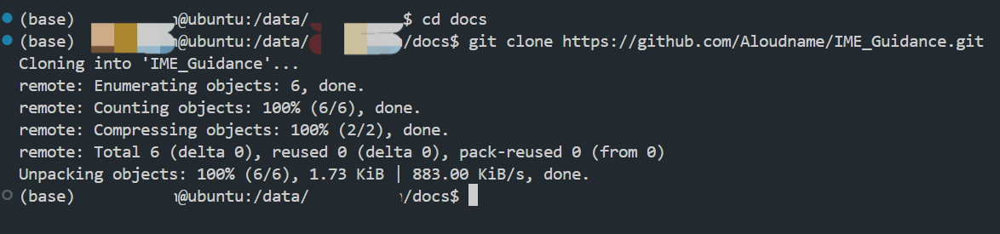
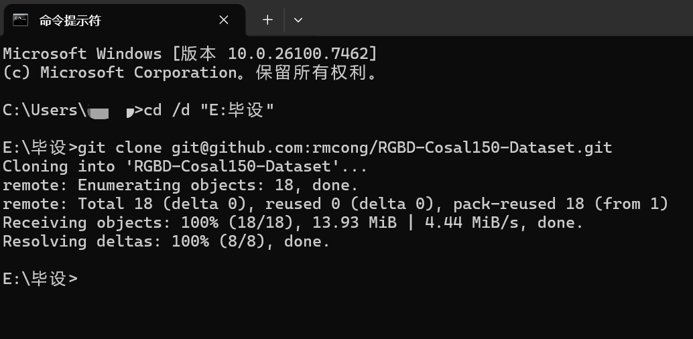

# 1 GitHub使用

author @Aloudname @ZebraWoo

## 引言

[GitHub](https://github.com/) 是世界上最大的代码托管平台。实际上，它托管的不仅仅有代码，还有一些电子书等等其他资料（比如 [公开书籍-mymmsc](https://github.com/mymmsc/books)）。实际上就是一个人人可用的仓库。这个仓库还支持多人共同创作、管理一个大型项目的代码，用起来很方便。

另外，一个人的 GitHub repo 也反映了他的工作方向、最近在做的项目以及他的项目受到了多少人的关注等等。拥有高收藏的 GitHub repo，或者成为著名开源项目（比如深度学习领域的 [PyTorch库](https://github.com/pytorch/pytorch)）的重要贡献者，在找工作时的 ~~威力比原子弹还要大~~ 加分程度不低于顶刊。

## 入门

这个教程包含注册、新建项目、项目管理、多人协作开发项目时的注意事项等。

[参考教程](https://github.net.cn/zh/get-started/quickstart#google_vignette)

建议是边用边练，一边锻炼写代码的能力，一边锻炼代码工程化管理的能力。在你的代码编辑器中（以 vscode 举例），搜索以下拓展并安装：


这样就能在编辑器里方便地提交对项目的更改，以及查看别人的提交了：


## 复制别人的仓库

如果想将别人仓库里的代码搬到自己的开发环境中，GitHub 对此提供了方便的几种办法：


第一种是直接下载打包的.zip文件，然后手动解压；

第二种是直接在 VSCode 编辑器中打开；

第三种我最常用，是复制其 SSH 命令，然后在目标位置运行命令:

```bash
# 切换路径
cd /d <目标路径>

# 格式：git clone <git地址>
git clone git@github.com:rmcong/RGBD-Cosal150-Dataset.git
```

比如：

- Ubuntu 系统（一种 Linux 系统的发行版）中：



- Windows 系统中使用 `win + R` 唤出并输入 `cmd` 进入命令行：



- 也可以直接左键单击目标文件夹的路径，输入 `cmd` 进入命令行：


这种方法需要本地安装 git 服务并且配置好 GitHub 账户。只需配置一次，后面非常方便。

安装、配置 git 服务的教程可以参考 [这里](https://blog.csdn.net/2301_80035882/article/details/155000175)。

## 协作使用

GitHub最大的特点在于任何人都能参与开源项目。不管是团队内的协作开发，还是心血来潮想为某开源仓库做贡献。