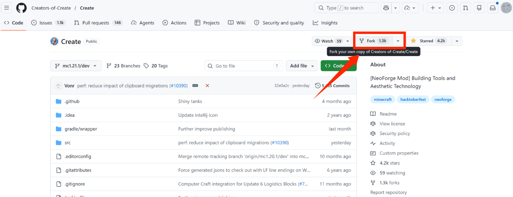
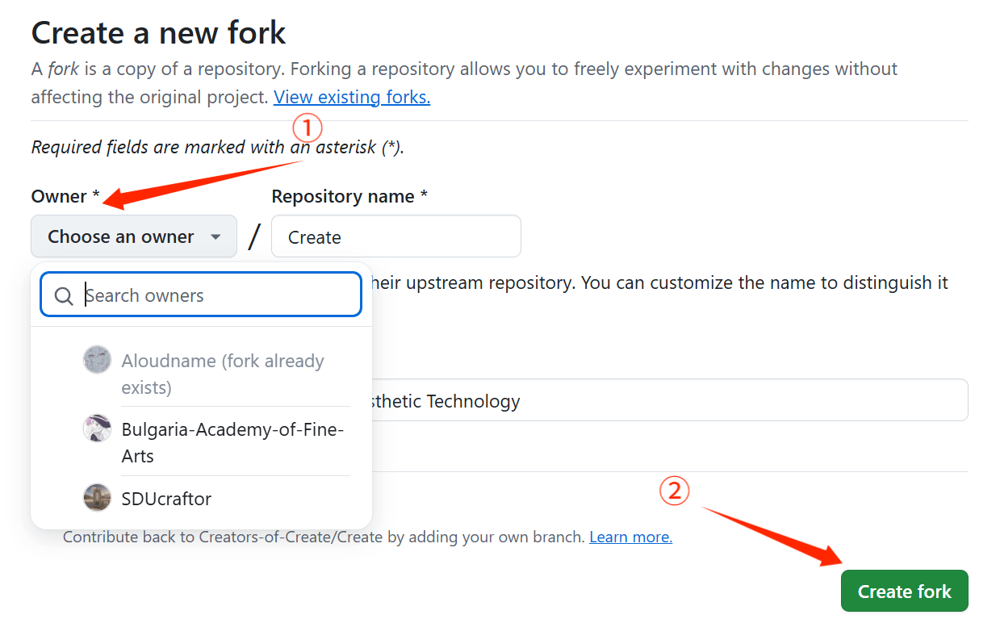
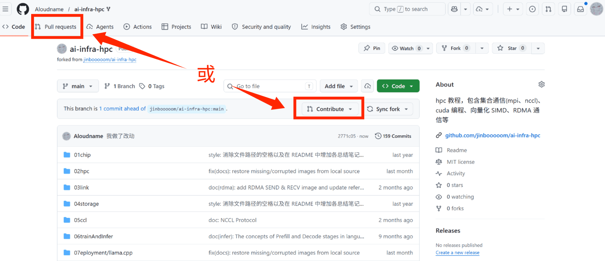
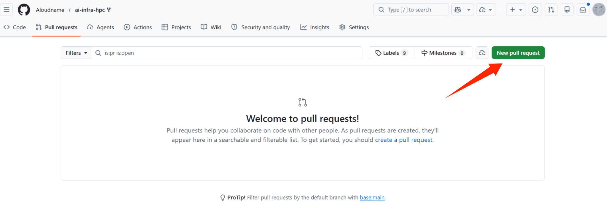
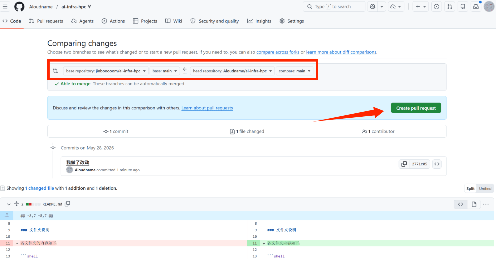
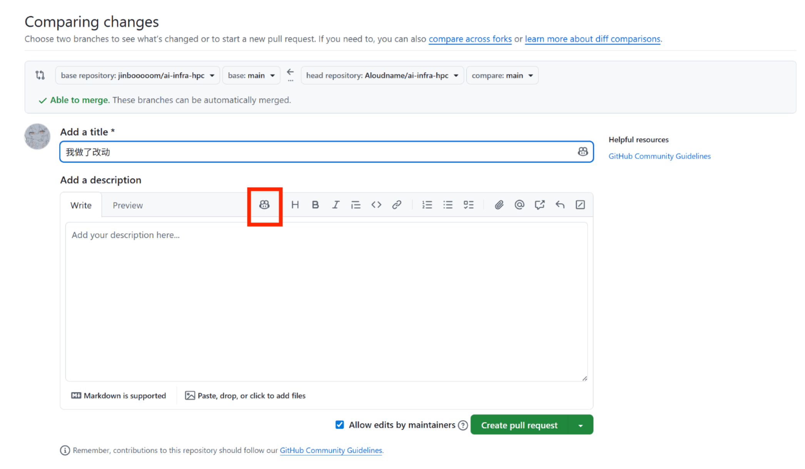
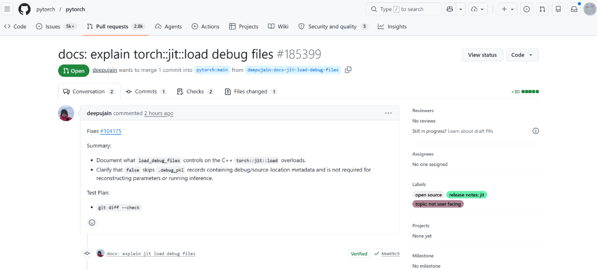
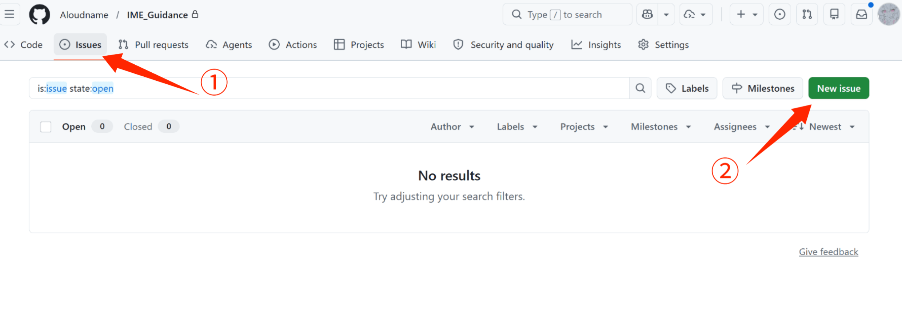
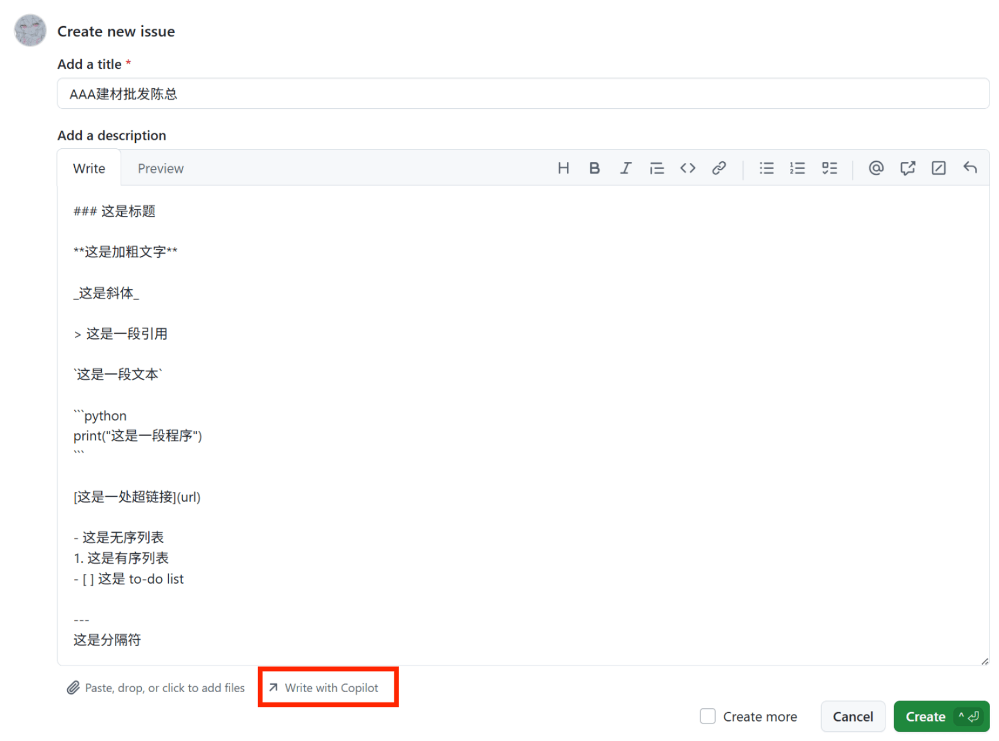

# 2 社区里的仓库

>   **[<span style="color:inherit;">Aloudname</span>](https://github.com/Aloudname)**

这一节我们学如何跟别人的仓库打交道，下载仓库、提交反馈、创建分支、提交合并申请等。

## 1. 使用 clone 下载别人的仓库

[1_GitHub使用.md](1_GitHub使用.md) 里提到的 `clone` 也可以下载别人仓库里的代码到本地（自己的开发环境）。方法和之前一样，可以下载打包的 .zip 文件，或者准备好仓库路径用命令行 clone。


以 SSH 举例：

```bash
# 进入要下载到的目标路径里
cd /d <目标路径>

# 命令格式：git clone <git地址>
git clone git@github.com:rmcong/RGBD-Cosal150-Dataset.git
```

第一次使用这种方法需要配置好 GitHub 账户。只需配置一次，后面非常方便。

注意，这些方法只是下载了别人的代码。如果你想基于别人的仓库创建一个属于自己的拷贝仓库，需要用到下面的 `fork`。

## 2. 使用 fork 创建拷贝

我们没有直接修改别人仓库的权限。如果我们想贡献内容，怎么办？首先要创建属于自己的 **分叉仓库**（`fork`）。这个分叉其实就是源仓库的一个拷贝，只不过所有权属于自己。我们可以对这个分叉随意做更改，与源仓库互不影响（注意，源仓库的改动也不会影响分叉）。借助这个特性，我们可以用分叉仓库学习、扩展别人的源代码，这就是 `fork` 的意义。

在我们想拷贝的源仓库，点击 `Fork` 按钮，并在新页面选择将分叉仓库的所有权划给谁（我们的个人账户，或者我们加入的某组织），最后点击 `Create fork`。这样我们就创建了一个可以直接改动的分叉仓库。




注意分支（branch）和分叉（fork）是完全不一样的。分支（branch）对应 **同一仓库** 不同版本 / 功能的程序，而分叉（fork）对应所有权不同的 **诸多仓库**。

## 3. 使用 pull requests 贡献内容

我觉得自己新增的内容很不错，比原作者的水平高十分甚至九分。这么好的程序，若不发出去岂不可惜！这时候我该怎么做呢？这就是 **Pull Requests**（**PR**）的工作。确认好自己的更改已经上传到 GitHub 上的分叉仓库后，我们进入分叉仓库。这时候会出现一个状态栏，提示

> “This branch is xxx commit ahead of <源仓库>”

也就是说我们的分叉相比源仓库有了新的改动。我们可以点击这个状态栏里的 `contribute` ，也可以点击上方的 `pull requests`。这两个按钮最终都会将我们定向到新建一个合并请求的界面。



比如我们点击了 `pull requests`，就会进入下面的界面。点击 `New pull request` 创建一个新的合并请求：



这样，系统就会给我们列出这个分叉相对于源仓库的改动。另外，红框框中还可以选择将分叉仓库的哪个分支（branch）合并到源仓库的哪个分支里。对初学者来说，一般情况下都是唯一的主分支（`main`）合并到主分支（`main`）中，不必改动。检查分支和更改的内容没问题后（请务必做这件事），点击 `Create pull request`：



这个页面需要填写这次合并的信息，是展示给源仓库所有者用的，因此可以填写得详细一点。如果懒，可以点击红色框框，让 GitHub 内置的 Agent —— Copilot 帮你写一份。主要说明你做改动的地方以及原因。如果有新函数/变量/类等一切新内容，请不吝键盘给出其类型、用法和结构。这个页面和 `issues` 也是一样的，支持 `.md` 文本。



以下是一个对 PyTorch 库发起合并请求的实例。请求的发起者完善了 PyTorch 的注释内容（微不足道但也重要），在合并请求中说明了改动的性质（docs，对应文档修改）和改动的内容（解释某调试文件）。



下面的图就描述了 `fork` 和 `pull requests` 的过程：


## 4. 提交 issues

issues 是非常方便的反馈方法。直接在源仓库点击 `issues` 进入，这里可以看见其他人提交的反馈，还有仓库所有者的回复。点击 `new issue`，填写标题和正文，最后点击 `create` 就能提交啦！正文其实就是一个 `.md` 文件，因此支持各种 markdown 组件和功能。红色的框框可以让 Copilot 帮忙写。




## 5. GitHub 的其他功能

### GitHub actions

假设我们是某项目的管理者。每当有人提交了对仓库的 pull requests（PR）时，我们都要亲自检查一下 ta 提供代码的结构、风格、错误等等，非常麻烦。可不可以配置一个自动化的工作流，每次 PR 时固定触发，代替我们完成这些工作呢？另外，如果我们用仓库存储一个数据集，可不可以做自动化流程，对每次新加入的数据做预处理呢？这就是一种 [CI/CD 工作流](https://cloud.tencent.com/developer/article/2635802)。

**GitHub actions** 是 GitHub 内置的 CI/CD 自动化工具。挖个坑：[教程](https://www.bilibili.com/video/BV1jNSEBiE6D?vd_source=3e42722ff1d4439fadc7c36ddfc692be)。

### wiki

每个仓库附带一个 **wiki** 页面，用于写更详细的文档。容易上手、量大管饱的文档在公司和大型项目中非常重要。

### projects
**projects**（项目看板）是管理复杂项目进度的看板视图。

我们可以慢慢来，学会 `issues` 和 `pull requests` 已经够用了，它们是参与开源社区的基本功。

---

至此，GitHub 的基础使用就介绍完了。

回顾一下，我们在 [1_GitHub使用.md](1_GitHub使用.md) 学会了 `init` 创建仓库、`pull` 拉取更新、`add/commit/push` 提交自己的更改、用 `.gitignore` 管理忽略文件、查看历史和撤销更改，以及分支和远程仓库的基本操作；

在 [2_社区里的仓库.md](2_社区里的仓库.md) 学会了 `clone` 仓库到本地、`fork` 创建属于自己的分叉仓库、`pull requests` 合并不同的分叉仓库、`issues` 向仓库开发者提供反馈等等。

有了这些基础，在日常开发和团队协作中管理项目就非常简单了。下一篇是关于进阶问题的，主要包括一些实践中可能遇到的问题，比如如何处理合并冲突（merge conflicts）、规范 commit 信息以及合并过程中的代码评审（code review）。