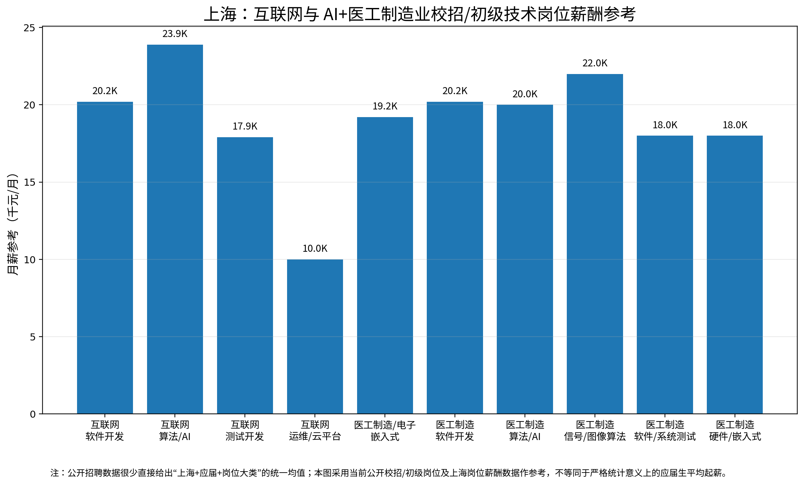
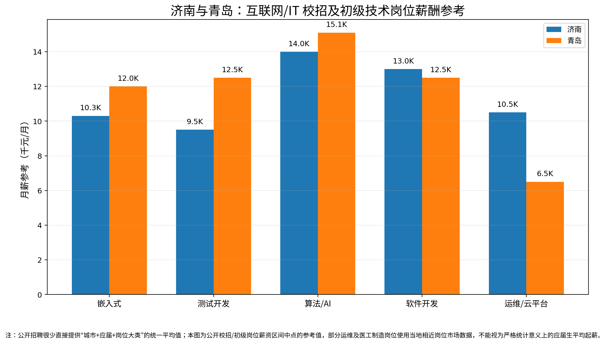
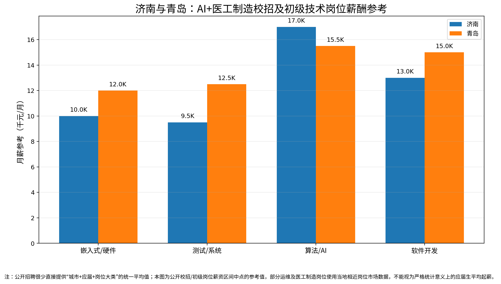

# 1 求学的起点

>   **[Aloudname](https://github.com/Aloudname)**

本科四年，很多仅有一面之缘的任课老师不约而同地问我们：

*“这个专业到底是干嘛的？”*

当然，作为懵懂孩子的我们很难回答这个问题，因此老师们得到的回答基本上是沉默和意味深长的笑。即使非要说出答案，有些人会给出 “公司研发岗”、“医院技术岗” 等比较模糊的定位。有时，系里的老师鼓励我们时，也会提起优秀学长学姐拿到了医疗科技界 “大厂”（比如 [联影](https://global.united-imaging.com/zh-cn/)、[迈瑞](https://www.mindray.com/cn)）的 Offer，等等。不同的人给出的答案不同，但无论如何，如果初入校园时能对自己的专业有所了解，以后的个人发展会有更多主动权。

## 1. 电类工科？

我们从填志愿开始看。给到 “夯” 的计算机科学与技术、电气工程，给到 “人上人” 的集成电路与微电子（电子科学与技术）、控制科学与工程（自动化）、信息与通信工程等等，这些热门志愿都属于 “电类工科”。电网相关的 “电气工程师”、计算机相关的 “软件工程师”、微电子相关的 “半导体工程师”，以及生物医学工程相关专业的工程师等等，无论工作内容如何，这些工程师在学校里学到的基础知识大体相同。几乎每个从事这一行的人都（有所侧重地）要学习如何分析电路、分析不同形式的电信号、用电磁信号传递信息 / 能量、用指令控制计算机以及计算机如何运作的等等。

这些都是我们 BME / IME 的近邻，也是日后择业时 **除医工行业以外的可选方向**。我们以后可能做医疗器械，也可能做医学软件、医学图像、人工智能。如果愿意继续补计算机基础，也可以转去做软件开发、算法或者其他计算机相关工作。作为电子电气大类的学生，无论我们日后从事何职业，最好需要具备相当完备的电学和计算机知识素养。

## 2. 弱电？

人类用电来传递信息或能量。从工程应用上看，强电传输和转换能量，而弱电用于传输、处理和表示信息。强电系统中的电压、电流和功率通常较大，而弱电信号功率较小，对信号质量和抗干扰能力的要求高。我们用几个例子给大家讲一讲本科杂七杂八的专业课。

心电、脑电等等生物电信号，含有大量干扰信号（噪声），携带信息的分量可能非常小，也就是其信号、噪声的比例（**信噪比**）非常低。**电子信息专业** 就研究如何提取、处理、分析各种电信号，而不论 BME 还是 IME，都会学习 **信号与系统（Signal & System，SS）** 和 **数字信号处理（Digital Signal Processing，DSP）** 这两门专业基础课。

心电监护仪、血氧仪或可穿戴设备里都有一个小型计算机。这种小型计算机本体只有一个可编程的小主板，连接各种传感器和显示器。比如采集 **连续的心电信号** 后，经过 **模/数转换** 送进 **数字信号处理器**，根据编程设定的流程进行滤波、计算，并把变换后的波形显示出来。这个过程涉及分别处理连续 **模拟信号** 和离散 **数字信号** 的 **模拟电路** 和 **数字电路**（BME 和 IME 都要学）这两门专业基础课，以及 **嵌入式开发** 这门专业课。这些是有关 **底层硬件控制** 的内容。相比 IME，BME 会侧重学这个部分。

一段心电信号能否说明心律失常？一张影像能否找出可疑病灶？从统计学的角度，异常区域 / 波段相较正常位置肯定有较大差异。要找出这种差异，需要设计合适的数学模型描述数据分布，再设计算法指导计算机算出这种分布规律的参数。这就是 **算法工程师** 的工作。我们常风闻某些资深技术人员 “年入百万” 的成功学故事。其中相当一部分人便从事算法相关岗位。实际上该类岗位的平均薪资确实较高（*图a：2026 上海市校招岗位平均薪资；图b、c：2026 济、青二市互联网 / 医工制造校招岗位平均薪资*），对求职者的能力和学历要求也更高。

传统算法与 **数据结构** 这门（貌似是 IME 独有的）专业基础课关系密切，涉及搜索、排序、图论、优化等在 [LeetCode](https://leetcode.cn/) 上经常遇到的问题。现在的算法岗还会涉及 **机器学习（Machine Learning，ML）** 和 **深度学习（Deep Learning，DL）** 的数学基础进和相关技术栈。因此，比较重要的课程有 **数据结构与算法（DSA）**，还包括 **概率论与数理统计**、**线性代数**、**最优化方法**（研究生课程）、**机器学习** 和 **深度学习** 等。

## 参考文献

[1] *MORGAN McKINLEY. *China Salary Guide 2026: Mainland China* [EB/OL]. 2026[2026-09-03].*
用于参考上海地区软件开发、算法、测试、运维等 IT 技术岗位的市场薪酬水平。该数据属于全市场薪酬参考，并非严格意义上的应届毕业生平均薪资。

[2] *职友集. 上海软件开发相关岗位薪酬统计[EB/OL]. [2026-09-03].*
用于参考上海软件开发岗位的公开招聘薪酬区间及市场水平。

[3] *职友集. 上海AI算法工程师薪酬统计[EB/OL]. [2026-09-03].*
用于参考上海人工智能、算法工程师岗位的公开招聘薪酬水平。

[4] *职友集. 上海嵌入式工程师薪酬统计[EB/OL]. [2026-09-03].*
用于参考上海嵌入式软件、嵌入式开发等岗位的公开招聘薪酬水平。

[5] *职友集. 上海测试软件开发工程师薪酬统计[EB/OL]. [2026-09-03].*
用于参考上海软件测试、测试开发岗位的公开招聘薪酬水平。

[6] *牛客. 联影医疗：软件算法工程师（信号处理方向）- 上海（J19727）[EB/OL]. 2026[2026-09-03].*
用于说明医疗器械企业中信号处理算法岗位的实际招聘需求，包括生理信号、降噪、滤波、时频分析、统计分析、特征提取、阵列信号处理，以及 C/C++、MATLAB、Python 等技能要求。

[7] *牛客. 联影医疗：软件算法工程师（图形图像方向）- 上海（J19789）[EB/OL]. 2026[2026-09-03].*
用于说明医学图像处理、图像重建、图像分析、3D 渲染、机器视觉、深度学习等岗位，以及生物医学工程、电子信息、通信、计算机、自动控制等专业与该类岗位之间的对应关系。

[8] *牛客. 联影医疗：软件算法工程师（大模型方向）- 上海（J19788）[EB/OL]. 2026[2026-09-03].*
用于说明医疗企业已经出现大语言模型、医疗文本数据集、模型训练、微调及模型评估等相关算法岗位。

[9] *牛客. 联影医疗：软件算法工程师（AI/图形图像）- 上海（J14849）[EB/OL]. 2023[2026-09-03].*
用于参考该企业较早期校招中 AI、医学图像处理、图像重建、分割、配准、深度学习、机器视觉、3D 重建、CUDA 等岗位要求及公开薪资水平。

[10] *浪潮集团. 浪潮集团校园招聘[EB/OL]. 2026[2026-09-03].*
用于参考该地区大型 IT 企业的校招岗位结构，包括 Java、C++、Python 软件研发、算法、软件测试、实施及硬件相关岗位。

[11] *山东大学就业信息网. 浪潮集团2026届校园招聘信息[EB/OL]. 2026[2026-09-03].*
用于辅助确认企业在该地区的校招岗位结构，包括软件研发、算法、硬件、实施及测试等岗位。

[12] *职友集. 济南服务器运维工程师薪酬统计[EB/OL]. [2026-09-03].*
用于参考该地区服务器运维岗位的市场薪酬水平。该数据为公开招聘职位统计，不等同于应届生平均薪资。

[13] *职友集. 济南运维工程师薪酬统计[EB/OL]. [2026-09-03].*
用于参考该地区普通运维岗位的薪酬分布及应届生岗位占比。

[14] *中创软件工程股份有限公司. 中创软件招聘信息[EB/OL]. [2026-09-03].*
用于参考该地区软件开发、算法、软件测试等 IT 技术岗位及公开招聘薪酬区间。

[15] *积成电子股份有限公司. 2026校园招聘信息[EB/OL]. 2026[2026-09-03].*
用于参考该地区嵌入式软件、AI 算法、智能电网及新能源预测等岗位。

[16] *众阳健康科技集团有限公司. 2026校园招聘信息[EB/OL]. 2026[2026-09-03].*
用于参考该医疗信息化、医疗大数据、AI 算法、医学影像、临床决策支持等岗位。

[17] *海尔集团. 海尔集团校园招聘[EB/OL]. 2026[2026-09-03].*
用于参考该地区软件研发、嵌入式软件、大数据、算法、人工智能、智能传感器等岗位结构。

[18] *海尔智家股份有限公司. 2026校园招聘信息[EB/OL]. 2026[2026-09-03].*
用于进一步参考该地区智能制造、软件、AI、嵌入式及智能硬件相关岗位。

[19] *海信集团. 海信集团校园招聘[EB/OL]. 2026[2026-09-03].*
用于参考该地区软件算法、软件开发、硬件研发、芯片、光学、结构、制造及质量等技术岗位。

[20] *海信医疗设备股份有限公司. 校园招聘信息[EB/OL]. 2026[2026-09-03].*
用于参考该医疗器械企业中的医学图像处理、超声图像处理及算法工程师岗位。

[21] *东软载波. 2026校园招聘信息[EB/OL]. 2026[2026-09-03].*
用于参考该地区嵌入式软件、软件测试、硬件、Java 及电力电子等岗位。

[22] *英科医疗科技股份有限公司. 2026校园招聘信息[EB/OL]. 2026[2026-09-03].*
用于参考该医疗制造企业中的软件开发等技术岗位。

[23] *青岛海信信息科技股份有限公司. 2026校园招聘信息[EB/OL]. 2026[2026-09-03].*
用于参考该地区 Java 软件开发等 IT 技术岗位。

[24] *青岛豪江智能科技股份有限公司. 2026校园招聘信息[EB/OL]. 2026[2026-09-03].*
用于参考该地区嵌入式软件、嵌入式硬件等智能制造技术岗位。

[25] *青岛海汇德电气有限公司. 2026招聘信息[EB/OL]. 2026[2026-09-03].*
用于参考该地区嵌入式软件开发岗位及其公开招聘薪酬。

[26] *青岛润鹏电子技术有限公司. 招聘信息[EB/OL]. [2026-09-03].*
用于参考该地区算法、软件测试等岗位的公开招聘薪酬。

### 数据说明

本文 *校招/初级岗位薪酬参考* 据企业校招、招聘平台公开信息及地区岗位薪资统计整理得到，并非官方统计意义的应届毕业生平均薪资，相关数字仅供参考。

